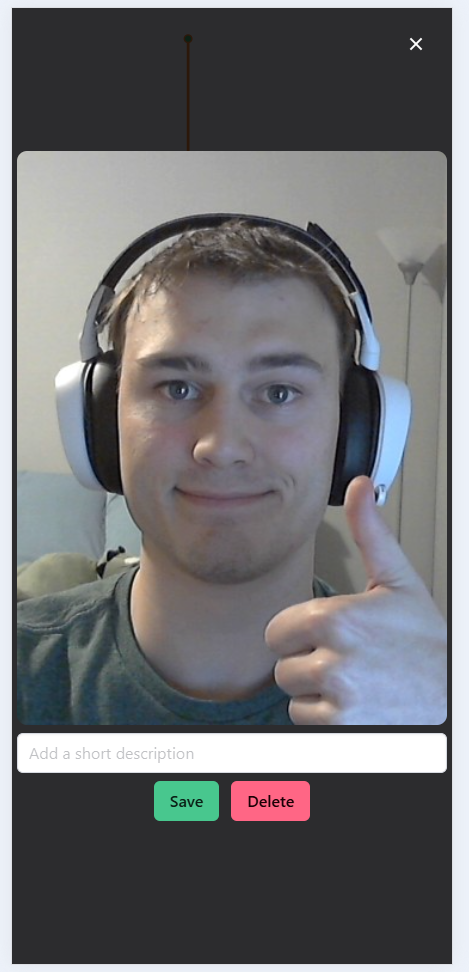
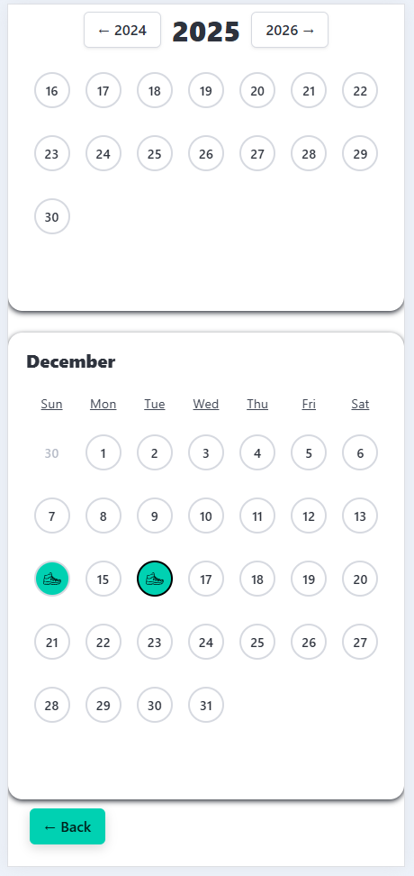
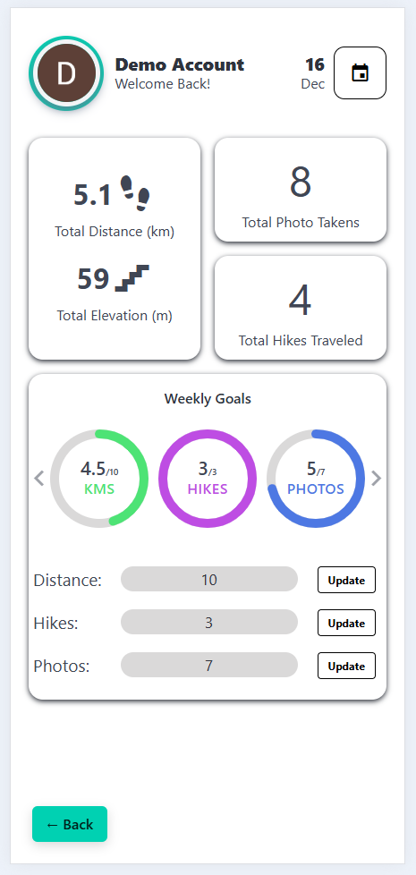

# Module 2 Group Assignment

CSCI 5117, Fall 2025, [assignment description](https://canvas.umn.edu/courses/518559/pages/project-2)

## App Info:

- Team Name: Very Tired
- App Name: TrailLens
- App Link: <https://very-tired-project-2.web.app/>
- LucidSpark: <https://lucid.app/lucidspark/efbdc8f9-d48d-4787-b2c0-7fa831dff212/edit?invitationId=inv_b3eeaf56-86ec-49b5-be63-04101f93399b>

### Students

- Alex Knusel, knuse001@umn.edu
- Sam Bassan, bassa050@umn.edu
- Shuo Jiang, jian1105@umn.edu
- David Tomlinson, tomli104@d.umn.edu

## Key Features

**Describe the most challenging features you implemented
(one sentence per bullet, maximum 4 bullets):**

- Trail line implementation (figuring out accuracy, smoothing, and drawing the line).
- Real-time weather api data and logic for location based updates to the weather widget.
- Goals and calendar implementation (figuring out cutoffs for goals and proper formatting of dates).
- Camera integration in the hike and ensuring it was smooth and seemless.

Which (if any) device integration(s) does your app support?

- Geolocation (GPS)
- Camera integration
- Offline mode - if you lose signal for a period of time (typically you only have connection at beginning of trail head) the web app will continue attempting the requests until you have signal again (typically when you finish the hike at the trail head).

Which (if any) progressive web app feature(s) does your app support?

- All minimal PWA features (icons)
- Basic caching of the web app (load even when offline)

## Mockup images

TrailLens is a website for tracking hikes and viewing your previous hikes. Our mockup shows all of the main pages and features. We opted for a highly extensible view and are relying on the Beufy (built on top of Bulma) component library to help us easily scale to a desktop view, which is why we did not mock the desktop view.

## Testing Notes

**Is there anything special we need to know in order to effectively test your app? (optional):**

- The Start Hike page requries the app to remain open to enable the real time trail line updates. This is a limitation of web app's, if we did this as a Native Mobile App we would not have this limitation.
- You can use the [Sensors tab](https://developer.chrome.com/docs/devtools/sensors) in Chrome to simulate your GPS without having to use your phone. Make sure you set the accuracy to 20 or below because we use this to filter out "bad data".
- There may be issues with the weather widget because chrome "forgets" it allowed the application to use the location and blocks the location request because it want's the user to be reprompted even when you've already granted it location access. This is rare, but can happen time to time, we fixed it by going into Chrome Developer Settings and deleting the site as allowed location accessing website and refreshing.

## Screenshots of Site (complete)

### Home Screen

### Start Hike (Main View)

### Start Hike (Camera Preview)

### Start Hike (w/Photo Carousel)

### Previous Hikes

### Individual Hike

### Individual Hike (w/Photo)

### Calendar

### Goals

## External Dependencies

- https://www.weather.gov/documentation/services-web-api : weather api used to pull real-time data from tower observations and forecasts.

**If there's anything else you would like to disclose about how your project
relied on external code, expertise, or anything else, please disclose that
here:**
External code references are commented within the code
